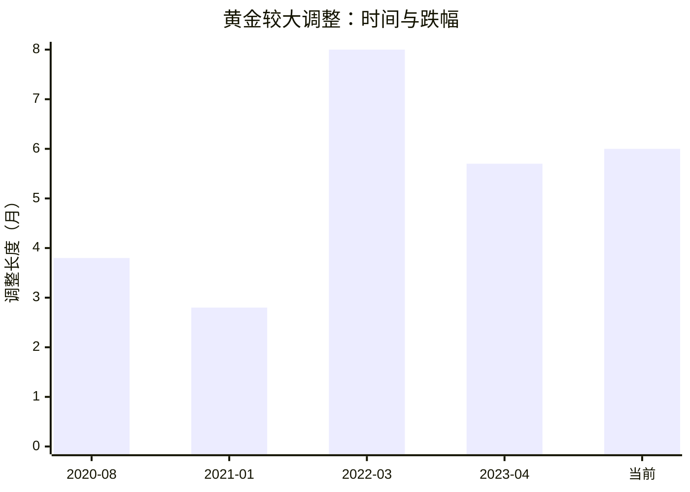
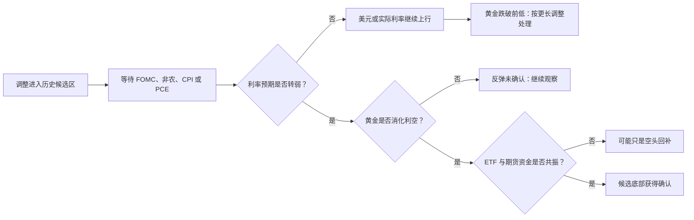

先给结论。

黄金调整进入历史常见的时间区间，不等于它会自动上涨。时间只负责告诉你：这里值得等。利率、美元、就业和通胀等关键事件，才负责告诉你：上涨是否真的开始。

这套方法不预测某一天的价格。它把“我觉得差不多跌够了”改成两步：先用历史调整长度划出候选区，再等事件和价格确认。

{/* truncate */}

## 从一段下跌开始讲

2022 年，黄金在 3 月冲到约 2,039 美元。俄乌战争刚爆发，能源和粮食价格上涨，市场担心通胀失控。

之后，故事换了主角。美联储开始快速加息。美元变强，持有无利息黄金的机会成本上升。黄金跌到 11 月初约 1,629 美元。

这段调整约 8 个月，跌幅约 20%。

当时没有一个人能在 3 月就知道低点是 11 月。投资者只能在每一个月问同一个问题：这还是正常调整，还是牛市已经结束？

答案不是从新闻标题里找。要先看时间。

## 先把历史调整变成区间

从 2020 年以来，黄金上行过程中的较大调整大致如下。价格以美元/盎司计，时间从阶段高点到阶段低点。

| 调整 | 跌幅 | 持续时间 |
|---|---:|---:|
| 2020 年 8 月到 11 月 | -14.7% | 3.8 个月 |
| 2021 年 1 月到 3 月 | -13.3% | 2.8 个月 |
| 2022 年 3 月到 11 月 | -20.1% | 约 8 个月 |
| 2023 年 4 月到 10 月 | -11.2% | 5.7 个月 |

这些数字不提供一个“第几个月必涨”的公式。它们只给出三个观察区间：

- 2 到 4 个月：普通调整可能结束，也可能只是中继；
- 5 到 6 个月：进入较长调整的末段候选区；
- 接近 8 个月：接近 2022 年级别的深调整长度。

当前这轮若从 2026 年 1 月下旬约 5,405 美元的高点算起，到 7 月下旬已约 6 个月，最大回撤约 26%。

它在时间上已经进入候选区。它在跌幅上甚至超过了 2022 年。

这句话很重要：**候选区不是买入信号。**它只是提醒你，不要再把每一次下跌都当成同一种下跌。你应该开始寻找转折条件。

上图只比较调整长度。当前已经超过 2023 年的 5.7 个月，但仍短于 2022 年接近 8 个月的深调整。

| 调整 | 回撤 | 长度 |
|---|---:|---:|
| 2022 年 3 月到 11 月 | -20.1% | 约 8 个月 |
| 当前 | -25.6% | 约 6 个月 |

当前的跌幅已经比 2022 年更深。不能只因“还没到八个月”就假定下跌已经结束。

## 再等一个事件改变市场的提问方式

2022 年 11 月 4 日是一个好例子。

前两天，美联储刚刚连续第四次加息 75 个基点。金价一度继续下跌。市场问的是：美联储还要加多少。

11 月 4 日，美国就业报告显示，10 月非农就业增加 26.1 万，表面仍然不弱；但失业率从 3.5%升至 3.7%。市场开始看到劳动力市场松动。

问题于是变成：美联储能否继续用同样的速度加息？

美元下跌，黄金当天大涨。这不是因为美联储已经停止加息。美联储后来仍继续加息。真正变化的是市场对未来利率路径的预期。

你要找的正是这种变化：

图里的顺序不能颠倒。时间先让你进入观察区；事件先改变利率预期；美元、实际利率、价格和资金随后验证。

## 用四个问题判断事件有没有效

每次 FOMC、非农、CPI 或 PCE 公布后，不要先看新闻说它“鹰”还是“鸽”。按下面四个问题检查。

1. **利率预期变了吗？**

   市场是否降低了后续加息概率，或开始计入更早降息？只看本次是否加息不够。

2. **美元和实际利率回落了吗？**

   黄金的反弹若伴随美元走弱、实际利率下降，质量更高。若黄金独自小涨，美元仍强，反弹更可能只是空头回补。

3. **黄金能否消化利空？**

   数据偏热、联储偏鹰，但黄金不再跌破前低，这比一根阳线更有价值。它说明卖方开始减少。

4. **资金有没有跟上？**

   ETF 流入、期货仓位和价格同步改善，才更接近新一轮上涨。只有期货猛涨而 ETF 没有流入，要防止短线挤空。

## 把当前 FOMC 放进方法里

当前黄金靠近 4,000 美元。它处于六个月深调整后的候选区，而 FOMC 正好提供一次验证。

不必预先赌结果。把结果分成三类：

| 事件后结果 | 对方法的解释 | 下一步 |
|---|---|---|
| 联储弱化后续加息，美元与实际利率回落，黄金站上短期反弹高点 | 候选底部得到第一层确认 | 跟踪能否形成更高低点 |
| 联储维持中性，黄金仍在 4,000 附近横盘 | 时间到了，但事件未确认 | 保留观察，不抢跑 |
| 联储更鹰，黄金跌破前低且美元继续走强 | 候选底部被证伪 | 按更长调整处理，参考 2022 年的 8 个月样本 |

这套方法的好处，是允许你错过最低点。

最低点只有事后才知道。你真正要拿到的是一段可验证的上涨，而不是在下跌中猜中最后一根阴线。

## 记录时只写这六项

以后每轮黄金调整，都在日志里固定记录：

1. 阶段高点日期和价格；
2. 当前回撤幅度；
3. 已持续多少个月；
4. 历史上处于哪个长度区间；
5. 下一个可能改变利率预期的事件；
6. 事件后美元、实际利率、价格和资金流是否共振。

这样你会把“黄金还会不会涨”变成一个持续更新的问题。

不是等一个宏大叙事兑现。是先等调整走到该观察的位置，再等市场给出它愿意重新定价的证据。

## 给这套方法留一条边界

调整长度只适用于你仍判断黄金处在长期上行趋势的前提。

如果美元持续走强、实际利率上行、ETF 连续流出、央行买盘减弱，而且价格不断跌破前低，那么它可能不是牛市调整，而是趋势反转。此时不能拿“还没到八个月”给自己找理由。

反过来，如果金价在鹰派事件后也不再下跌，且美元和实际利率开始转弱，六个月也不必硬等到八个月。

时间给你耐心。事件给你方向。价格和资金，负责最后确认。

## 数据出处

- 📗 黄金价格：世界黄金协会 [Gold Prices](https://www.gold.org/goldhub/data/gold-prices)，美元/盎司；
- 📗 2022 年 11 月就业：美国劳工统计局 [Employment Situation](https://www.bls.gov/news.release/archives/empsit_11042022.pdf)；
- 📗 2022 年 11 月 FOMC：美联储 [政策声明](https://www.federalreserve.gov/monetarypolicy/files/monetary20221102a1.pdf)。
