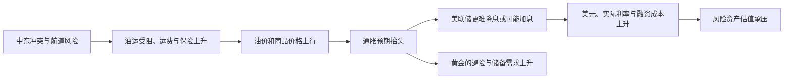
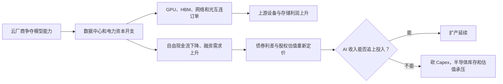
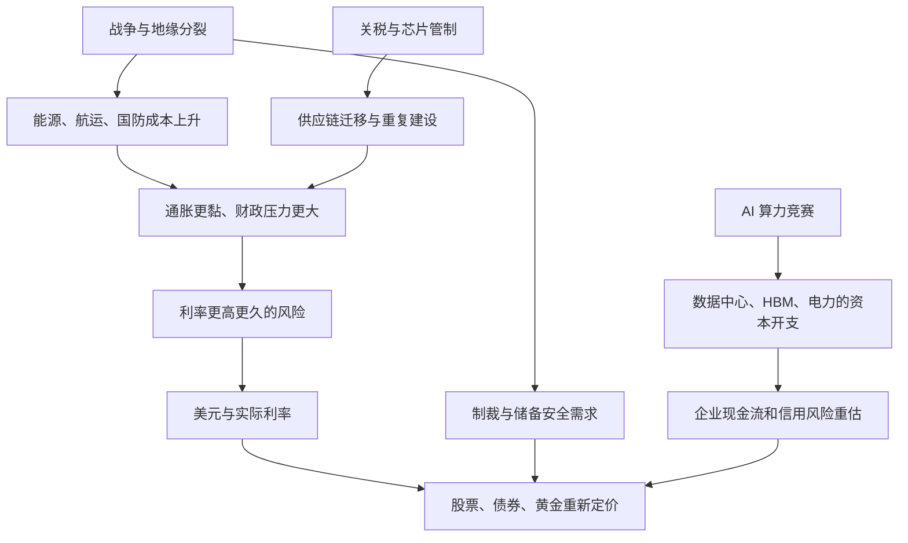

先给结论。

最近的世界大事不是一条“有人在幕后统一操盘”的故事。更接近的事实是，全球同时进入了三个更贵的时代：安全更贵，能源更贵，算力更贵。

这三件事共同挤压企业现金流、政府财政和居民购买力。它们最终都会回到同一个问题：谁承担成本，谁得到定价权，谁需要美元融资。

这才是水下暗线。

{/* truncate */}

## 先把图里的故事拆开

你给的图里有几件可核实的事：美光业绩创纪录；SK 海力士在美国资本市场融资；存储和 AI 硬件股在高位出现剧烈回撤；大科技公司的 AI 资本开支开始被债券市场审视。

这些事实能连成产业链。

但图里“谁在分润”“华尔街先做空再收购”“某位政治人物亲自设计整套行情”这类说法，公开资料没有证据。把它们当成结论，会让你错过真正可交易、也可验证的变量。

📗 美光 2026 财年第三季度收入为 414.56 亿美元，GAAP 净利润为 282.43 亿美元，毛利率为 84.6%。这不是传闻，是公司披露的周期高点利润。

📗 SK 海力士确实完成 Nasdaq ADR 上市。公司公开表述的目的，是扩大美国投资者基础、加强与全球 AI 计算生态的联系，并筹集产能和技术投资所需资本。

📙 这两件事一起出现，更合理的解释是：AI 资本开支把 HBM 和高端存储推到供给紧、利润高的阶段；美国资本市场正在吸收这一轮扩产与估值。它不自动证明利益输送或刻意砸盘。

## 第一条暗线：战争先改变能源，再改变利率

中东冲突的核心金融影响，不只是“地缘风险利好黄金”。它先作用于霍尔木兹海峡、红海和油运保险。

运油船不敢走、绕行时间变长、保险变贵，油价先动。油价再进入汽油、化肥、运输和食品价格。最后，通胀重新变得难以下降。



📗 IMF 的基准情景已经把中东战争视为全球增长与再通胀的风险来源。它预计，若冲突范围有限，全球增长仍会从此前水平放慢至 2026 年的 3.1%；冲突扩大、商品价格上升和金融条件收紧，属于主要下行风险。

📗 WTO 也指出，AI 商品需求曾抵消部分关税和不确定性的冲击，但中东冲突及其对油运的影响重新恶化贸易前景。

所以，油价上涨对黄金不是单向利好。第一阶段，市场担心通胀，预期更高利率，黄金会受实际利率压制。第二阶段，如果增长被能源成本拖慢、财政和金融体系承压，黄金才会交易政策错误、信用风险和储备多元化。

## 第二条暗线：美国进入“高利率也不能轻易停”的财政时代

美国政府、企业和居民都习惯了低利率。现在它们面对的是更高的再融资成本。

美联储要压住通胀，就必须让资金更贵。政府却有巨额债务需要滚动融资，企业又要为数据中心、国防和供应链迁移筹钱。

这不是说美联储会服从任何一位总统。更准确的说法是，政策每走一步，都会同时碰到通胀、就业、国债利息和金融稳定四个约束。

📗 截至 7 月，美联储目标利率为 $3.50%-3.75%$。市场关注的已经不只是本次是否行动，而是油价和通胀会不会让后续紧缩重新成为主线。

你要盯的不是政治口号，而是：

- 美国核心 PCE、工资和就业是否同时走热；
- 10 年期实际利率是否持续上行；
- 美元指数是否在坏消息中继续走强；
- 长端国债收益率是否在联储不动时仍上升。

最后一项尤其重要。它说明市场开始要求更高的财政风险补偿，而不是只在交易短期政策利率。

## 第三条暗线：AI 不是轻资产软件故事，它正在变成重资产竞赛

过去两年，市场把 AI 主要当成软件生产率故事。现在，越来越多的现金流要先变成芯片、HBM、光模块、电力、土地、冷却和数据中心。

这解释了为什么美光能出现极高利润，也解释了为什么云厂商的股债投资者开始紧张。



📗 穆迪指出，Amazon、Meta、Alphabet、Microsoft、Oracle、CoreWeave 等公司的 AI 基础设施投资，正在消耗自由现金流并提高外部融资需求。它并未说这些公司已经失去偿债能力；它说的是商业模式从轻资产走向重资产，信用市场开始要求重新定价。

这就是存储股和 AI 基建股会同时出现“业绩极强、股价大跌”的原因。股价不只看本季利润，还看明年 Capex 能否转化为客户收入。

对你之前提到的“费城半导体回撤、头部科技回撤”应这样理解：

- 📗 上游存储利润很强，代表当前订单和供给关系强；
- 📙 股价回撤可能是市场在下调未来 Capex 的可持续性，不必然是订单已经消失；
- 📕 只有当云厂商削减资本开支、存储现货或合约价转跌、库存上升同时发生，才更接近产业周期见顶。

## 第四条暗线：芯片不再只是商品，而是联盟能力

美国对先进 AI 芯片和远程算力访问的限制，正在从单纯的出口管理，变成一套联盟、云服务、设备、人才和资本的制度竞争。中国也在讨论对 AI 模型和芯片实施更严格的出口控制。

📗 美国的先进芯片出口限制仍在收紧讨论中。中国企业获得先进算力的海外路径也因此受到更严格审查。

这会把产业链推向四个方向：

1. 产能更集中于美国、台湾、韩国和少数盟友；
2. 中国加速做本土替代，但技术、设备与软件生态需要时间；
3. 韩国存储厂商的战略价值上升，因为 HBM 是 AI 加速器的关键瓶颈；
4. 企业会为“可靠供应”付更多钱，全球效率因此下降。

SK 海力士赴美上市，放在这条暗线里看更清楚：这不是某个国家“分掉利润”的证据，而是关键供应商主动嵌入最大 AI 资本市场和客户生态。它会提升融资能力，也会让它更受美国投资者、监管和大客户周期影响。

## 第五条暗线：贸易没有停止，只是变得更短、更贵、更政治化

关税、出口管制和战争并没有让全球化消失。它们改变了全球化的组织方式。

📗 WTO 估计，按最惠国税率进行的全球贸易份额已下降到 72%。2025 年 AI 相关产品需求支撑了贸易，但企业也在关税实施前提前备货、调整库存和迁移供应链。

这会制造一种很容易误判的繁荣：

```text
关税预期上升
    ↓
企业提前进口、提前建厂、提前囤货
    ↓
本期贸易与制造数据看起来很强
    ↓
政策落地或库存补足后，订单可能回落
```

因此，不能只看出口、航运和芯片一个季度的高增长。要问增长来自最终需求，还是来自提前备货和政策套利。

## 第六条暗线：欧洲重整军备，世界进入更高的财政底座

俄乌战争没有变成短期冲突。欧洲正把防空、导弹、弹药、无人机和本土产能视为长期财政项目。

📗 欧洲与乌克兰正在推进防空和武器生产合作，俄乌双方的无人机与导弹升级也持续把能源设施和供应链卷入风险。

这带来两个长期结果：

- 国防订单给航空航天、电子、材料和能源安全投资提供更长的需求底座；
- 更高的财政支出与更紧的产业政策，会和能源成本一起占用资本、推高政府融资需求。

这条线不会每天影响股价，但它改变的是未来数年的通胀中枢、财政赤字和资产配置。

## 第七条暗线：黄金的角色从交易品回到储备资产

在战争、制裁、资本管制和储备冻结风险上升时，很多央行重新评估“什么资产在极端情况下仍可用”。

📗 世界黄金协会 2026 年调查显示，89%的受访储备管理者预计全球央行黄金持有量未来一年继续增加，45%预计本机构会增持；74%预计美元在全球储备中的份额五年后更低。

这不是美元会立刻被黄金替代。美元仍是支付、融资、贸易定价和避险流动性的核心。

更准确的变化是：

- 短期危机时，市场仍先抢美元；
- 中长期，部分央行把黄金视作不依赖他国负债表的储备；
- 因此黄金既受美元和实际利率压制，也获得了更稳定的官方部门需求。

这也解释了黄金为何会在高利率下仍维持高位波动，而不是简单重复过去“利率升、金价必跌”的关系。

## 把七条线合成一张地图



这张图不是预测某个结果。它解释为什么最近经常出现看似矛盾的组合：

- 战争升级，黄金却因美元走强先跌；
- 存储公司利润爆发，股价却因 AI Capex 的融资压力下跌；
- 贸易数据走强，企业却在为未来关税提前囤货；
- 政府加大投资，债券市场反而要求更高收益率。

## 用这张地图观察接下来三个月

| 你要观察的信号 | 它回答什么问题 | 主要影响 |
|---|---|---|
| 霍尔木兹和红海的通航、油运保险、Brent 油价 | 能源冲击会不会变成持续通胀 | 利率、美元、黄金 |
| 美国核心 PCE、就业、10 年实际利率 | 联储会否被迫更久维持紧缩 | 黄金、长久期资产 |
| 云厂商 Capex、自由现金流、债券利差 | AI 投入能否被融资市场接受 | GPU、存储、光模块 |
| HBM 合约价、存储库存、客户指引 | 存储利润是延续还是周期见顶 | 美光、海力士、存储链 |
| 芯片限制、关税落地与实际豁免 | 供应链是迁移还是中断 | 中美科技链、出口企业 |
| 央行黄金储备和 ETF 流 | 黄金是官方承接还是短线投机 | 黄金趋势质量 |

## 最后把“暗线”放回事实边界

世界正在发生的是多中心竞争，不是某个单一中心控制一切。

美国要控制通胀、技术优势和债务成本。中国要守住增长、供应链和技术自主。欧洲要补安全能力。资源国要在油气、航道和货币之间提高议价权。企业要在 AI 投入和现金流之间做选择。

这些目标相互冲突，才会形成今天的高波动。

对投资来说，最有价值的“暗线”不是猜谁设计了行情。是确认成本、资本和定价权正在往哪里移动。

## 数据出处

- 📗 IMF，[2026 年 4 月世界经济展望](https://www.imf.org/en/publications/weo/issues/2026/04/14/world-economic-outlook-april-2026)；
- 📗 WTO，[2026 年全球贸易展望](https://www.wto.org/english/news_e/news26_e/wto_report_2026.pdf)；
- 📗 美光，[2026 财年第三季度业绩](https://investors.micron.com/news-releases/news-release-details/micron-technology-inc-reports-record-results-third-quarter)；
- 📗 SK 海力士，[Nasdaq ADR 上市公告](https://news.skhynix.com/en/skhynix-lists-adrs-on-nasdaq/)；
- 📗 世界黄金协会，[2026 年央行黄金储备调查](https://www.gold.org/goldhub/research/central-bank-gold-reserves-survey-2026)；
- 📙 AI 融资风险，穆迪观点的 [新闻转述](https://www.cnbc.com/2026/07/24/moodys-ai-spending-credit-quality-amazon-meta-alphabet.html)；
- 📙 中东冲突与航运，持续变化的 [路透转述](https://money.usnews.com/investing/news/articles/2026-07-28/oil-prices-fall-5-to-two-week-low-on-hopes-for-us-iran-conflict-easing)。

