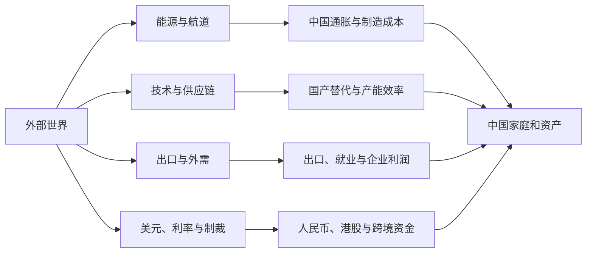

先给结论。

国际环境确实在恶化。但恶化的不是所有经济活动，而是安全成本。

能源要为航道风险付费。芯片要为阵营限制付费。贸易要为关税和原产地审查付费。跨境资金要为支付与制裁风险付费。与此同时，AI 投资和亚洲制造仍在增长，全球经济没有进入全面衰退。

从中国人的视角看，真正的暗线是：**美国试图把安全、技术和美元继续绑在一起；中国则用制造能力、区域贸易、能源储备和人民币结算，降低被单一体系卡住的风险。** 中间国家不愿选边到底，它们会同时与中美交易。

这对中国投资者有四条直接影响：中东决定输入成本，美国决定美元资金和技术上限，中国内需决定 A 股利润，全球 AI 资本开支决定半导体与亚洲制造的景气度。

{/* truncate */}

> 数据截至北京时间 2026 年 7 月 29 日 20:30。📗 表示已由一手来源或多家可靠来源核实；📙 表示基于已核实事实的推断；📕 表示尚待验证的叙事。

## 先看中国站在哪里

中国目前不是简单的“经济强”或“经济弱”。更准确的说法是：**生产和出口强，内需和投资弱，新产业快，旧资产负债表仍在调整。**

📗 2026 年上半年，中国 GDP 为 69.6 万亿元，同比增长 4.7%。一季度增长 5.0%，二季度放缓至 4.3%。同期，社会消费品零售总额增长 1.3%，固定资产投资下降 5.7%，房地产开发投资下降 18.0%，民间投资下降 8.5%。

📗 另一面也很强。上半年货物进出口增长 16.9%，其中出口增长 13.4%，进口增长 22.1%。高技术制造业增加值增长 13.3%，集成电路产量增长 23.1%。国家统计局对当前矛盾的表述是“供强需弱”。

这组数据说明三件事。

1. 只要外需和科技投资还在，中国制造业就有支撑。
2. 只要房地产、民间投资和消费没有明显修复，企业盈利就会分化。
3. 外部能源冲击会同时打击居民购买力和制造业利润，影响比美国更直接。

中国的优势是完整工业链、贸易规模、较低通胀、资本管制和政策动员能力。短板是原油进口依赖、内需不足、房地产与地方财政、高端芯片约束，以及海外需求和航道安全。

## 看清四条传导链

世界新闻很多，但真正能进入中国资产价格的通道并不多。

这四条线可以压缩成一句话：**中国用美元买能源和技术，用制造品换外汇，再用外汇、黄金和跨境支付网络保护这套循环。**

## 美国在同时经营美元、技术和安全

美国的优势不是单独的美元或军力。它把深资本市场、国债、技术标准、能源产量和盟友网络组合在一起。别国需要美元结算、安全承诺或美国技术时，也会增加对美国金融体系的依赖。

它的矛盾同样清楚。

📗 CBO 预计，美国 2026 财年赤字约 1.9 万亿美元，占 GDP 的 5.8%；到 2036 年，赤字可能达到 3.1 万亿美元。净利息支出是长期赤字扩张的重要推力。美联储金融账户显示，2025 年四季度联邦政府债务约为 33.9 万亿美元。

美国既想压低融资成本，又不能放任通胀。既想制造业回流，又要承受更高生产成本。既要盟友承担更多安全费用，又不能让联盟离心。

### 用三层证据看特朗普团队

不要猜一个统一的“终极计划”。把政策拆成三层更可靠。

| 层次 | 能确认什么 | 不能直接推出什么 |
|---|---|---|
| 公开目标 | 关税、能源增产、再工业化、放松监管、盟友分摊 | 政策一定会成功 |
| 实际政策 | 2026 年政府经济报告继续强调贸易再平衡、能源主导和监管改革；4 月又提高部分钢铝铜产品关税 | 所有措施都只服务一个行业 |
| 资本网络 | 捐款、PAC、游说、合同、豁免会影响政策入口 | 捐款本身就证明行贿或政策被买下 |

📗 FEC 数据显示，2025 年初至 2026 年 3 月底，国会候选人募资 21.27 亿美元，政党委员会募资 11.21 亿美元，PAC 募资 63.00 亿美元。这足以证明金钱深度参与美国政治，但不能证明每项政策都是腐败交易。

📙 从中国视角看，美国两党的共同部分比口头冲突更重要。对华技术限制、关键供应链回迁、国防投入和产业保护已经具有跨党派连续性。中国企业不能把希望建立在一次美国选举上。

### 等美联储给答案，不替它提前宣布

📗 截至本文截稿，美联储 7 月会议结果尚未公布。市场主流预期是维持利率，但中东能源冲击让加息讨论重新出现。

对中国资产，美联储通过三条线起作用：

- 利率越高，美元资产越有吸引力，人民币和港股的资金面越承压；
- 美元越强，中国进口能源和原材料的人民币成本越高；
- 美国高利率压低全球需求，又会影响中国出口。

所以，不要只问“加息还是降息”。还要看 10 年期实际利率、美元指数、油价和美国信用利差是否同向变化。

## 中国争取的不是马上取代美元

中国更现实的目标是获得选择权。贸易可以用人民币结算。储备可以增加黄金。支付可以不只经过一套网络。能源可以从海运、管道和不同国家获得。

📗 2024 年银行代客人民币跨境收付 64.1 万亿元，同比增长 22.6%。2025 年上半年为 34.9 万亿元。2024 年货物贸易人民币结算占比为 27.2%，2025 年上半年升至 28.1%。

📗 CIPS 在 2025 年处理 180.15 万亿元业务。系统规模很大，但“处理金额”包含金融和银行间资金流，不能把它直接等同于人民币完成了同等规模的国际贸易结算。

📗 IMF COFER 显示，2026 年一季度美元占已分配外汇储备 57.13%，欧元占 20.03%，人民币只占 1.99%。美元份额当季还从 56.42% 上升。约一半增幅来自汇率估值变化。

这组数据同时反驳两种极端说法。

- 📕 “人民币没有国际化”不对。贸易结算和支付基础设施已经形成规模。
- 📕 “人民币即将取代美元”也不对。结算货币、融资货币和储备货币不是一回事。人民币储备份额仍小，资本项目也未完全开放。

📗 2026 年 5 月末，中国外汇储备为 3.4422 万亿美元，黄金储备连续第 19 个月增加。中国持有的美国国债约为 6593 亿美元。

这不是简单的“抛弃美元”。中国仍需要高流动性的外汇资产来稳汇率、付进口和处理危机。增加黄金和人民币结算，是在这套底盘上加保险。

## 中东决定中国的输入成本

中东不是一个角色。以色列关注安全边界和军事威慑。伊朗关注政权安全、制裁突破和地区影响力。沙特及海湾国家关注油气收入、安全担保和产业转型。三者会合作，也会冲突。

从中国视角看，最重要的不是判断谁在道义上获胜，而是看三件事：霍尔木兹能否通航，油气能否按合同交付，冲突是否把美国重新拖回中东。

📗 Kpler 经 Reuters 统计，2025 年中国进口的原油、成品油、LNG 和 LPG 中，约 49.4% 来自中东。原油一项约 52% 来自中东。中国已经用俄罗斯、中亚、南美、库存和电动车降低冲击，但短期仍无法无成本替代海湾供应。

📗 世界银行 2026 年 4 月基准情景预计，Brent 全年均价约为 86 美元；如果扰动持续，可能进入 95 至 115 美元区间。该估计是情景，不是目标价。

📗 7 月 29 日，围绕霍尔木兹通航安排的斡旋仍在继续。短暂停火没有消除航运和保险风险。因此，油价中的战争溢价可能快速回吐，也可能被新的航运事件重新拉高。

对中国企业，影响并不平均。

- 上游油气、煤炭和部分航运可能受益；
- 航空、化工下游、轮胎、物流和高耗能制造更容易受损；
- 居民燃料和运输支出上升，会进一步挤压其他消费；
- 如果国内成品油调控延缓传导，压力会在财政、炼厂或产业链内部重新分配，并不会消失。

## 俄罗斯给中国资源缓冲，也带来制裁风险

俄罗斯的任务是维持战争能力、出口收入和国内稳定。对中国而言，俄罗斯提供能源、粮食、矿产和欧亚陆路缓冲，也提供不经过霍尔木兹的供应。

代价也存在。与受制裁主体交易会带来结算、保险、航运和二级制裁风险。俄罗斯经济越依赖战争支出，民用投资、劳动力和长期生产率承受的压力越大。

📙 因此，中俄贸易不能只看总额。还要看折价、回款、运输能力、制裁名单和企业实际现金流。便宜资源只有安全送达并完成结算，才是真正的优势。

## 欧洲既是中国市场，也是产业竞争者

欧洲正在为国防、能源替代、电网和产业补贴增加支出。它会增加军工、电力设备和部分金属需求，也会抬高债券供给和财政压力。

对中国，欧洲有三重身份：它是重要出口市场，是汽车、化工、设备和绿色产业的竞争者，也是在安全上依赖美国、经贸上保留自主空间的力量。

📙 欧洲更可能走一条混合路线：安全上靠美国，贸易上保留中国市场，产业上加强补贴、关税和本地化要求。

这意味着中国企业出海不能只靠低价。它们要同时处理当地生产、合规、原产地和政治接受度。

## 东盟是中国供应链的外延

📗 2026 年上半年，中国与东盟贸易额约 4.34 万亿元，同比增长 18.2%。东盟继续是中国第一大贸易伙伴。越南、马来西亚和印度尼西亚是其中前三大伙伴。

东盟既承接中国制造，也采购中国设备、零部件和中间品。它不是简单把订单从中国抢走。很多时候，最终组装搬到了东南亚，上游仍与中国供应链相连。

风险在于美国和欧洲会加强原产地、转口和补贴审查。中国企业如果只把东盟当作换标签的通道，政策风险很高。真正有价值的是当地供应链、销售、就业和税收形成闭环。

## 印度同时是竞争者、市场和摇摆力量

印度有大市场、年轻人口和承接制造业的政策意愿。它与美国、日本合作，又继续购买俄罗斯能源，并强调战略自主。

📗 IMF 预计印度 2026 年增长约 6.4%。但印度原油进口依赖超过八成，中东冲突和油价是明显约束。

对中国，印度会在电子组装、药品、软件、低成本制造和全球南方影响力上竞争。它也需要中国设备、中间品和供应链经验。把印度写成“下一个中国”过于简单，把它完全排除在中国供应链之外也不符合现实。

## 日本和韩国各自掌握关键筹码

日本向全球提供资本、设备和材料。韩国掌握 HBM、DRAM、NAND、显示和造船等关键产能。两国是美国盟友，也无法忽略中国市场。

📗 2026 年 5 月，日本持有约 1.1431 万亿美元美债，韩国约持有 1323 亿美元。日本的利率和日元变化会影响全球资金回流。韩国的存储周期会影响整个 AI 硬件链。

中国投资者要分别看：

- 日本：日元、日债收益率、半导体设备与材料出口规则；
- 韩国：HBM 合约、普通存储价格、客户资本开支和对华工厂限制。

不能因为两国是美国盟友，就把它们当成没有自身利益的棋子。安全上配合美国，不代表企业愿意主动放弃中国收入。

## 朝鲜影响东北亚风险溢价

朝鲜追求政权安全、核威慑和外部资源。它对全球 GDP 的直接影响不大，但一次导弹、核试验或边境升级会迅速影响韩元、韩国股市、日元避险交易和区域军费。

📙 对中国而言，半岛稳定比任何一方短期占优更重要。失控冲突会带来边境、难民、贸易和美军部署变化等成本。

## 台海是不能轻视的尾部风险

台湾问题是中国主权和领土完整问题。投资分析不应拿战争作情绪化预测，也不应忽视外部干预、军事摩擦和供应链脱钩造成的尾部风险。

📗 CSIS 估算，2024 年约有 2.45 万亿美元货物经过台湾海峡，占全球海运贸易超过五分之一。这是外部研究机构的模型估计，不是确定损失数字。

风险传导不只来自军事冲突。演训升级、海运改道、保险费上升、芯片禁运和金融制裁，都可能先于极端情景影响资产。

从中国投资者角度，台海风险首先会打击全球半导体、航运和风险偏好，也可能同时压低人民币与港股。黄金和美元可能一起涨。不能把它当成单纯利好国产芯片，因为需求、设备、资本市场和整个经济环境都会同时受损。

## 用资产检查叙事是否成立

| 资产 | 中国投资者实际买到什么 | 当前主要驱动 | 最容易犯的错 |
|---|---|---|---|
| 人民币黄金 | 国际金价和美元兑人民币的组合 | 美国实际利率、央行购金、战争、人民币 | 看到战争就追高，忽略实际利率 |
| 美元 | 全球融资与危机流动性 | 美联储、美国增长、避险需求 | 把去美元化等同美元马上崩溃 |
| 人民币存款 | 低波动购买力和等待机会的现金 | 国内通胀、存款利率、汇率 | 只看名义安全，不看长期机会成本 |
| 中国国债 | 国内增长、通胀与货币政策 | 内需、信用需求、央行操作 | 把中国利率和美联储机械绑定 |
| A 股 | 国内政策、产业和人民币盈利 | 内需、财政、产业资本开支 | 用出口景气解释所有行业 |
| 港股 | 中国盈利、美元流动性和风险溢价 | 美债实际利率、南向资金、盈利 | 只因 PE 低就判断一定低估 |
| 美股 | 美国盈利、AI 投资和美元敞口 | Capex、现金流、利率、估值 | 把 AI 收入增速等同股东回报 |
| 美债 | 美元利率、通胀和财政供给 | 联储、期限溢价、拍卖需求 | 只押降息，不看长债供给和汇率 |
| 油气与资源股 | 商品价格减去成本和政策分配 | 航道、库存、OPEC+、需求 | 把油价上涨等同所有资源股盈利上涨 |

人民币黄金可以直接拆成公式：人民币金价（元/克）= 美元金价（美元/盎司）× USD/CNY ÷ 31.1035。

这解释了为什么国际金价回调时，人民币贬值可能缓冲国内金价跌幅。反过来，如果人民币升值，国内黄金涨幅也可能弱于国际黄金。

## 用三个情景观察未来三个月

| 情景 | 需要看到的证据 | 对中国的主要影响 | 资产倾向 |
|---|---|---|---|
| 航道恢复，通胀回落 | 霍尔木兹运量和保险费正常化，油价回落，美联储不再讨论加息 | 进口成本下降，制造利润和消费压力缓解 | 港股与制造修复；美元偏弱；黄金失去部分战争溢价，但仍看实际利率 |
| 能源滞胀延续 | 油价维持高位，美国通胀黏住，美联储偏紧 | 中国输入成本上升，外需受压，政策空间更难平衡 | 美元与人民币黄金偏强；长债和高估值成长承压；上游强于下游 |
| AI 投资转弱，技术限制加码 | 云厂商削减 Capex，存储订单降温，出口管制扩大 | 亚洲科技链盈利下修，国产替代加速但总需求变弱 | 半导体先杀估值；美债受增长担忧支持；A 股内部替代链强弱分化 |

三个情景可以交叉发生。例如，航道恢复不代表 AI 投资一定强。情景的用途不是押一个结局，而是提前规定你要看什么证据。

## 接下来只盯十个信号

1. 霍尔木兹实际船流、油轮保险费和 Brent 远期曲线；
2. 美国核心通胀、失业率和美联储表态；
3. 美国 10 年期实际利率与期限溢价；
4. DXY、USD/CNY 和中国银行结售汇；
5. 中国社零、房地产销售和民间投资；
6. 中国出口订单，以及对东盟出口与当地最终需求的差别；
7. 美国云厂商 Capex、HBM 合约和普通 DRAM 价格；
8. 欧洲对中国产品的关税、补贴与本地化规则；
9. CIPS、货物贸易人民币结算占比和离岸人民币流动性；
10. 央行购金、黄金 ETF 流量和金价对实际利率的反应。

如果新闻没有改变这十个信号，就先不要改变你的仓位。

## 最后的判断

📙 世界的主线不是美元立刻崩溃，也不是美国可以永远一家独大。它正在从“最低成本全球化”转向“为安全付费的全球化”。

中国在这轮变化中有真实优势：制造、基础设施、贸易网络和产业规模。中国也有真实短板：能源进口、内需、房地产、高端技术和美元金融体系的外部约束。

对中国投资者，最危险的两种故事正好相反。一种认为美国马上崩溃，因此美元和美债毫无价值。另一种认为中国只能被动承受，因此本土产业没有机会。数据都不支持这两种极端判断。

更有效的办法是看成本由谁承担，利润落到谁手里，再用汇率、利率、订单和现金流验证。

## 数据出处

- 📗 国家统计局，[2026 年上半年国民经济运行数据](https://www.stats.gov.cn/sj/zxfb/202607/t20260716_1964142.html)；
- 📗 商务部驻东盟使团，[2026 年上半年中国—东盟贸易简况](https://asean.mofcom.gov.cn/zgdmjm/tj/art/2026/art_4bbf54b3ecdb4223adbf91a6199f702f.html)；
- 📗 中国人民银行，[人民币国际化报告（2025）](https://hzfimage.mofcom.gov.cn/attach/202511/20251127143743684.pdf)；
- 📗 中国人民银行，[CIPS 2025 年业务统计](https://www.cips.com.cn/kjjqgs/articleFileDir/2025-12/05/c1ed77e02af749fb87cfb17484f9efb6.pdf)；
- 📗 国家外汇管理局，[2026 年 5 月末外汇储备数据](https://www.safe.gov.cn/safe/2026/0604/27533.html)；
- 📗 IMF，[2026 年 7 月世界经济展望更新](https://www.imf.org/-/media/files/publications/weo/2026/update/july/english/text.pdf)；本报告已按原文修正为 2026 年全球增长 3.0%、通胀 4.7%；
- 📗 IMF，[2026 年一季度 COFER 数据简报](https://data.imf.org/en/news/imf%20data%20brief%20july%201)；
- 📗 美国国会预算办公室，[2026—2036 预算与经济展望](https://www.cbo.gov/publication/61882)；
- 📗 美联储，[2025 年四季度金融账户](https://www.federalreserve.gov/Releases/Z1/20260319/z1.pdf)；
- 📗 美国财政部，[主要外国美债持有者](https://www.treasury.gov/resource-center/data-chart-center/tic/Documents/slt_table5.txt)，2026 年 5 月；
- 📗 美国联邦选举委员会，[2025—2026 周期前 15 个月资金统计](https://www.fec.gov/updates/statistical-summary-of-15-month-campaign-activity-of-the-2025-2026-election-cycle/)；
- 📗 美国白宫，[2026 年总统经济报告](https://www.whitehouse.gov/cea/2026-erp/)；
- 📗 世界银行，[2026 年 4 月大宗商品市场展望](https://www.worldbank.org/en/news/press-release/2026/04/28/commodity-markets-outlook-april-2026-press-release)；
- 📗 Reuters，[中国如何应对中东能源缺口](https://www.reuters.com/markets/commodities/how-china-is-plugging-energy-supply-gaps-left-by-us-iran-conflict-2026-04-14/)，2026 年 4 月；
- 📗 CSIS，[台湾海峡贸易量估算](https://features.csis.org/chinapower/china-taiwan-strait-trade/)。该来源用于测算航运暴露，不代表采用其政治立场。
