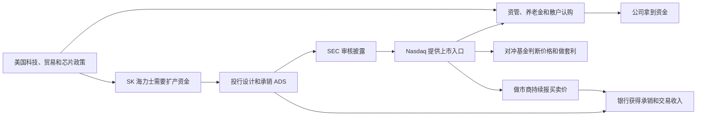
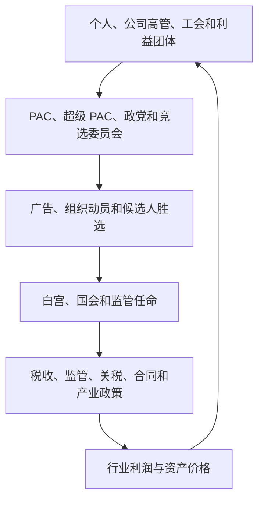
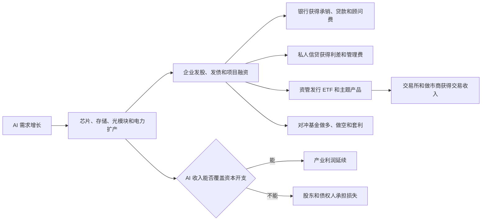
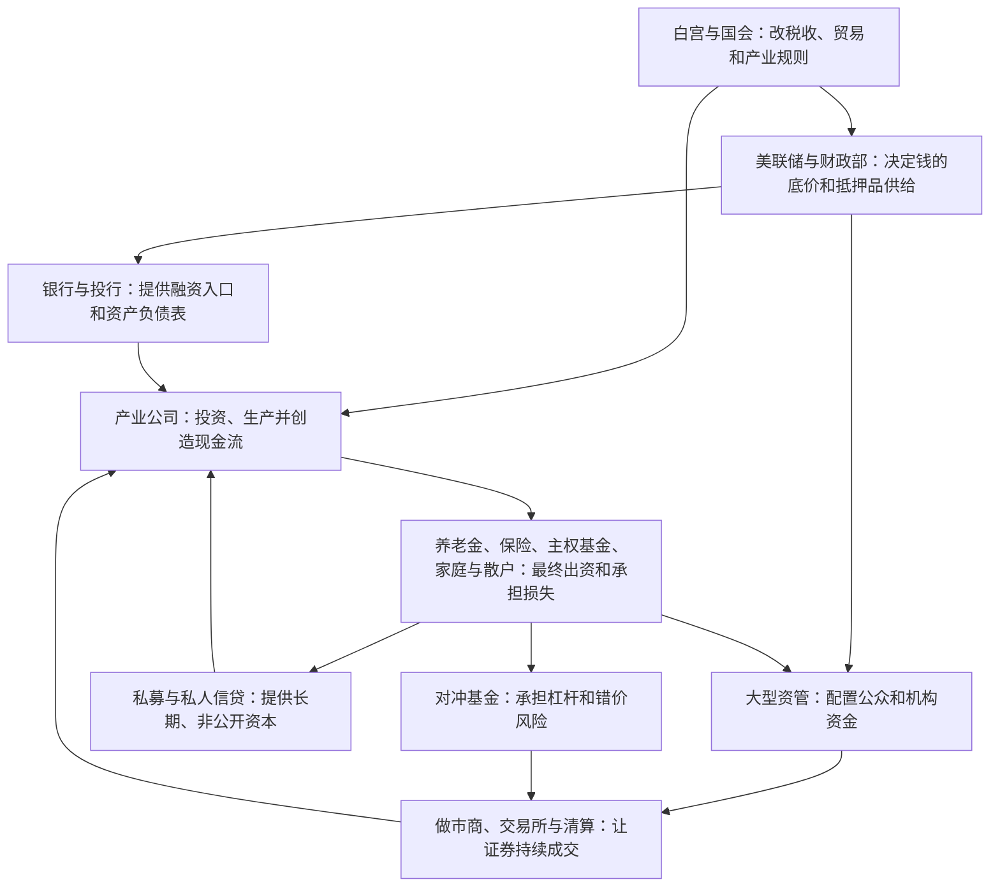

先给结论。

华尔街不是一个统一组织，也没有一个人坐在幕后给所有机构下命令。

它是一套资本网络。美联储决定钱的底价，财政部提供全世界最重要的抵押品，大银行把公司送进资本市场，资管机构配置客户的钱，私募机构接管企业和信用，对冲基金寻找错价，做市商负责成交，政治人物改写规则。

这些角色经常合作，也一直互相竞争。它们可以同时从一轮产业浪潮赚钱，却不需要共同策划这轮行情。

佩洛西属于立法权力层。特朗普属于行政权力层，同时带有企业家和品牌经营者身份。贝莱德、摩根大通、黑石、Citadel 才是金融机构。把四者叫作同一种“资本势力”，会让你误判新闻。

{/* truncate */}

> 资料截至北京时间 2026 年 8 月 1 日。2026 年仍未结束。📗 表示有官方文件或一手披露；📙 表示基于事实的推断；📕 表示公开证据不足的说法。文中的资产管理规模口径不同，不能直接相加。

## 从一笔韩国芯片融资看见整条街

2026 年 7 月，SK 海力士把美国存托凭证放到 Nasdaq 交易。它发行 1.779 亿份 ADS，每份代表 0.1 股韩国普通股，发行价为 149 美元，募集约 265 亿美元。美国银行、花旗、高盛和摩根大通担任主要承销商。

芯片由韩国工厂制造，HBM 的产业利润也先来自产品。但公司想把未来利润提前换成今天的扩产资金，就需要经过一整套金融机器。

华尔街没有把 HBM 的制造利润直接拿走。它做了三件事：

1. 把韩国股票包装成美国投资者能买的美元证券；
2. 把未来现金流变成今天的融资；
3. 在发行、交易、托管、融资和风险管理的每个入口收费。

📙 这也是理解最近新闻的起点。华尔街不一定需要押对 AI 最后的赢家。只要 AI 公司持续融资、并购、发债和交易，金融机构就能先赚手续费和价差。产业公司承担扩产风险，长期股东承担估值风险。

## 用十年时间线看权力如何移动

过去十年没有一条连续的阴谋线。更清楚的线索是：资本权力从银行资产负债表，逐渐向央行支持、被动资管、非银行做市和私人信贷扩散。

| 时间 | 发生了什么 | 暴露了哪块权力 | 留下了什么 |
|---|---|---|---|
| 2016 | 特朗普胜选。市场开始交易减税、放松监管和财政扩张 | 总统可以迅速改变行业利润预期，但不能直接命令所有资金买卖 | 政治消息开始更快进入利率、美元和股票估值 |
| 2017 | 《减税与就业法案》把联邦公司税率从 35% 降到 21%；美联储启动缩表 | 白宫与国会改变税后利润，美联储收回危机后的流动性 | 股东回购和盈利预期上升，资产价格同时面对货币收紧 |
| 2018 | 波动率产品在 2 月崩塌；美联储继续加息；中美贸易摩擦升级；四季度美股大跌 | 衍生品和拥挤交易会放大波动，贸易政策也能重估全球供应链 | “低波动”不等于低风险，杠杆经常藏在产品结构里 |
| 2019 | 9 月回购市场利率突然上冲，美联储恢复投放短期资金 | 国债很多，不代表随时都有足够现金承接。一级交易商的资产负债表有上限 | 市场第一次清楚看到，国债融资管道也需要央行维护 |
| 2020 | 疫情引发股债和美元融资冲击；美联储降至零利率、重启大规模购债，并设立公司信贷工具 | 美联储不只影响银行，还能给公司债市场建立信用后盾 | 市场形成更强的“危机时等央行”预期，资产价格与政策绑定加深 |
| 2021 | GameStop 逼空；Robinhood 限制部分交易；Archegos 爆仓 | 散户订单、期权、订单流支付、总收益互换和主经纪商连成一条杠杆链 | “散户对战机构”只是表层，清算保证金和隐藏杠杆才是底层 |
| 2022 | 美国 CPI 同比一度达到 9.1%；美联储快速加息；股票与债券同时下跌 | 当通胀约束央行时，“美联储托底”会失效 | 便宜资金时代结束，长久期资产、加密资产和杠杆策略一起重估 |
| 2023 | SVB、Signature 和 First Republic 相继倒闭；政府为存款和流动性建立紧急安排 | 银行持有的国债可以没有信用损失，却因利率上升产生巨大市值损失 | 存款可以在手机上快速迁移，银行挤兑速度远快于旧模型 |
| 2024 | SEC 批准多只现货比特币 ETP；AI 龙头推动指数集中上涨；日元套息交易短暂逆转 | 贝莱德等机构把加密资产接入传统账户，指数资金又把涨幅集中到少数巨头 | 新资产一旦 ETF 化，就进入托管、做市、期权和机构配置体系 |
| 2025 | 特朗普重返白宫后的关税冲击引发股债汇剧烈波动；加密监管转向；私人信贷继续扩张 | 白宫可以制造价格冲击，长债市场也会反过来约束政策 | 国债收益率上升会逼迫政府调整节奏，市场不是总统的下属 |
| 2026 至今 | AI 数据中心支出进入数千亿美元量级；科技公司更多使用发债、项目融资和表外结构；SK 海力士完成 265 亿美元 ADS 发行 | AI 从科技产品变成资本形成周期，银行和私人信贷争夺融资入口 | 华尔街的新利润池不只在芯片涨跌，还在未来多年的发债、并购、对冲和资产证券化 |

这条时间线可以压成三次迁移。

- 2016—2019：政策和低波动交易改变资产价格，但银行体系仍是主通道。
- 2020—2023：央行托底扩展到资本市场，杠杆又转移到基金、家族办公室和存款结构。
- 2024—2026：ETF、私人信贷和 AI 融资把更多权力交给非银行机构。

## 把华尔街拆成七块资本拼图

理解一家机构，先别看它“管理多少钱”。先看它控制哪个入口。

| 拼图 | 代表 | 控制的入口 | 主要怎样赚钱 | 它不是什么 |
|---|---|---|---|---|
| 规则和货币 | 美联储、财政部、SEC、FDIC、OCC、CFTC | 利率、美元流动性、国债供给、证券规则和银行监管 | 政府机构不以利润最大化为目标 | 不是一只统一的国家基金 |
| 银行和投行 | JPMorgan、Goldman Sachs、Morgan Stanley、BofA、Citi | 贷款、承销、并购、主经纪、外汇和债券做市 | 利差、承销费、顾问费、交易收入 | 不再能像 2008 年前那样无限使用自营杠杆 |
| 大型资管 | BlackRock、Vanguard、State Street、Fidelity | ETF、养老金、指数配置、股东投票和证券借贷 | 按资产规模收费，另有借券、顾问和技术收入 | 管理客户资产，不等于拥有这些钱和公司 |
| 私募资本 | Blackstone、Apollo、KKR、Ares | 非上市股权、地产、基础设施、保险资金和私人信贷 | 管理费、业绩分成、贷款利差、资本市场费用 | 不是每天都要按公开市场价格接受赎回 |
| 对冲基金 | Citadel、Millennium、D. E. Shaw、Elliott、Bridgewater | 杠杆、卖空、宏观交易、量化和公司治理行动 | 管理费、业绩分成和自有资本收益 | 不是一个方向一致的“空头集团” |
| 做市和交易管道 | Citadel Securities、Jane Street、Virtu、NYSE、Nasdaq、CME、ICE、DTCC | 报价、订单、交易所、期权、期货和清算 | 买卖价差、交易费、行情数据、订单流和技术服务 | 提供成交不等于长期看多或看空 |
| 最终出资人 | 养老金、保险公司、主权基金、大学捐赠基金、家族办公室和散户 | 决定钱交给谁管理，最终承担收益和损失 | 投资回报 | 经常藏在基金名称后面，却是资本网络的源头 |

这七块并非严格分离。摩根大通既是银行，也是资管机构和做市商。贝莱德从 ETF 扩展到基础设施和私人市场。KKR 和 Apollo 又通过保险平台获得长期资金。Citadel 是对冲基金，Citadel Securities 则是另一家做市公司。

📙 真正的趋势是边界越来越模糊。每家巨头都想得到期限更长、成本更低、不会轻易赎回的钱。

## 先看钱的底价由谁决定

美联储不是普通意义上的“资本大鳄”。它的权力比单个基金更底层。

联邦基金利率决定短期美元的底价。美联储资产负债表决定银行准备金和市场流动性。危机工具决定哪些抵押品能快速换到现金。

财政部则不断发行国债。国债既是政府融资工具，也是回购、衍生品保证金和全球储备的核心抵押品。财政赤字越大，市场要吸收的国债越多。银行、货币基金和海外投资者的承接能力就越重要。

2019 年回购市场冲击说明了这一点。企业缴税和国债结算同时抽走准备金，隔夜融资利率突然上升。美联储随后进行回购操作。问题不是美国政府马上违约，而是现金在错误的时间集中到了错误的位置。

所以，美联储控制的是资金价格，财政部创造的是抵押品，银行负责搬运资产负债表。三者互相依赖，也有目标冲突。

## 银行出售的不是股票，而是进入资本市场的门票

大银行最强的地方不只是钱多。它们同时连接企业、政府、基金和交易市场。

一家公司上市，银行收承销费。一家公司收购竞争对手，银行收顾问费。企业发行债券，银行负责定价和分销。对冲基金要加杠杆，主经纪部门提供融资和证券借贷。客户要对冲汇率和利率，交易部门提供衍生品。

Archegos 展示了这套网络的危险一面。它通过总收益互换建立大额集中持仓。不同银行看到的只是自己那一部分风险。价格下跌后，追加保证金和集中平仓把损失迅速传给主经纪商。SEC 后来指控其创始人和高管欺骗交易对手。

📙 这说明银行的弱点也来自入口太多。每一家都想争取大客户的交易收入，可能因此放松对客户总杠杆的判断。

## 三大资管管理资产，但不等于拥有世界

“贝莱德控制全球公司”是一种常见叙事。它混淆了受托管理、法律所有权和实际控制。

📗 截至 2025 年底，BlackRock 管理资产约 14 万亿美元。State Street Investment Management 管理约 5.7 万亿美元。Vanguard 也处于约 10 万亿美元量级。它们通过指数基金，频繁出现在美国大公司前十大股东名单中。

这些股票背后的钱来自养老金、个人退休账户、保险资金和普通 ETF 持有人。资管公司不能把客户资产直接拿来收购自己想要的公司。

但它们仍有三种真实权力。

1. **配置权**：指数纳入和 ETF 流量会改变一只股票的被动需求；
2. **投票权**：资管机构代表基金对董事、薪酬和股东提案投票；
3. **基础设施权**：风险系统、ETF 产品、现金管理和证券借贷把大量机构绑定在同一平台。

因此，正确说法不是“贝莱德拥有 14 万亿美元”，而是“贝莱德受托管理 14 万亿美元，并对资产配置基础设施和公司治理拥有显著影响力”。

## 私人资本把银行退出的地方变成生意

2008 年后，银行受到更严格的资本和流动性约束。大量融资活动转向私募股权、私人信贷、BDC 和保险平台。

📗 美联储估算，2024 年二季度美国私人信贷约 1.34 万亿美元，全球接近 2 万亿美元。美国市场规模约为 2009 年的五倍。

📗 截至 2025 年底，Blackstone 管理资产约 1.27 万亿美元，Apollo 约 9380 亿美元，KKR 约 7440 亿美元，Ares 约 6225 亿美元。Apollo 的信用资产占很大部分，KKR 和 Apollo 都有保险平台。

私人资本的权力来自四点。

- 资金锁定时间更长，不必每天面对 ETF 式赎回；
- 贷款由双方直接谈判，条款不必像公开债券那样完全标准化；
- 它们可以同时提供股权、债权、基础设施和重组方案；
- 保险保费和退休资金提供了长期、相对稳定的资金来源。

代价是透明度更低，估值更新更慢。公开市场一天跌 10%，私人资产可能一个季度后才调整账面价格。低波动有时来自缺少成交，不代表风险消失。

## 对冲基金和做市商不是同一种鲨鱼

中文新闻经常把量化、空头、对冲基金和做市商放在一起。它们的任务不同。

对冲基金用客户和合伙人资金承担方向、相对价值或事件风险。Bridgewater 做宏观，Elliott 以激进投资和困境资产闻名，Millennium 和 Citadel 采用多策略平台，D. E. Shaw 和 Two Sigma 更依赖量化。2025 年中的行业统计显示，头部机构单家对冲基金资产大多在 600 亿至 800 亿美元区间，远小于三大资管的 AUM，但它们使用的杠杆、衍生品和交易频率更高。

做市商的首要任务是同时给出买价和卖价。它们尽量快速对冲库存，从大量小价差中赚钱。Jane Street、Citadel Securities 和 Virtu 都属于这类核心机构。

GameStop 事件把两者的关系暴露给公众。散户通过券商买股票和期权，券商把部分订单交给批发做市商，清算机构根据波动提高保证金，做空基金承受逼仓损失。不同机构在同一条链上，却不代表它们站在同一边。

📗 SEC 对 2021 年市场结构的复盘，没有把 GameStop 的上涨简单归因于某个机构操纵。它讨论了做空、期权、订单流支付、清算和散户交易共同造成的结构压力。

## 政治不是第八家基金，而是改写收益分配的规则层

政治人物不需要亲自买卖数十亿美元，也能让资本重新定价。税率、关税、反垄断、银行资本要求、能源许可、芯片出口和加密监管都会改变行业现金流。

📗 FEC 统计显示，2023—2024 选举周期内，总统候选人募资约 20.12 亿美元，国会候选人约 38.02 亿美元，政党委员会约 27.46 亿美元，PAC 约 157.44 亿美元。公开申报的独立支出约 44.27 亿美元。各项存在流转关系，不能把它们相加后称作一场选举的“净成本”。

政治资金买到的通常不是一张写明政策回报的合同。它买到的是接触机会、议题传播、候选人存续和人事网络。捐款能证明利益关系，不能单独证明行贿。

这是一条可观察的利益循环，不是自动成立的腐败证明。要判断腐败，仍需寻找利益输送、隐瞒、对价或违法证据。

## 把佩洛西放回她真正的位置

南希·佩洛西不是一家基金的负责人，也不是华尔街交易员。她是长期掌握重要立法和议程权力的国会议员。她的争议来自公职权力与家庭投资同时存在。

📗 众议院 2025 年公开交易报告显示，Alphabet、Amazon、NVIDIA、Tempus AI 和 Vistra 等交易的所有者都标记为 `SP`，即配偶。报告披露的是金额区间，不是准确成本；部分交易是看涨期权。

这能确认三件事：

1. 相关交易确实申报过；
2. 交易由其配偶持有或执行；
3. 家庭持仓与科技、AI 和电力等政策敏感行业有重合。

它不能直接证明两件事：佩洛西本人下达交易指令，或交易使用了内幕消息。公开资料没有完成这两条证据链。

争议仍然合理。国会议员可以接触非公开政策信息，家庭又能持有个股和期权。现行 STOCK Act 主要要求申报，没有全面禁止议员及其配偶交易个股。申报最多可在交易后 45 天出现，而且金额只给区间。

所以，普通投资者不适合照抄“佩洛西作业”。你看到时价格可能已变，期权行权价和整体组合也可能被截断。更有价值的用法，是把申报当作政治利益冲突线索，而不是即时买入信号。

## 把特朗普看成政策联盟的组织者

特朗普也不是传统的华尔街银行家。他来自地产、品牌授权和媒体商业，进入白宫后掌握行政、任命、关税和监管权。

他的资本联盟在不同阶段变化。2016 年的主线是减税、能源、地产和放松监管。到 2024—2026 年，联盟又加入部分科技企业家、加密资产公司、私人资本和新右翼捐款人。传统银行和大型科技公司也会通过捐款、游说和高管接触同时经营两党关系。

📗 2025 年政府推动数字资产监管转向，并建立战略比特币储备和其他数字资产储备安排。📗 2025 年关税政策又一度造成股票、美元和美债同时波动。

这说明特朗普拥有强大的“重新定价权”，但没有完全控制市场。2025 年 4 月，10 年期美债收益率在市场动荡中快速上升。融资成本和国债市场压力反过来限制了政策空间。

判断特朗普与资本的关系，要分开四层：

| 层次 | 可以确认什么 | 不能直接推出什么 |
|---|---|---|
| 公开政策 | 减税、关税、能源、监管和加密政策文本 | 政策一定达到宣传目标 |
| 人事任命 | 官员来自哪些企业、基金或法律机构 | 该官员必然替原雇主办事 |
| 捐款和游说 | 谁投入了政治资金，重点游说什么议题 | 每笔钱都换来一项具体政策 |
| 个人和家族利益 | 公开财务披露、企业权益与政策是否重合 | 存在重合就已经构成违法 |

## 认识资本大鳄，先按能力分类

“资本大鳄”不是一种职业。以下人物影响市场的方式完全不同。

| 类型 | 代表人物 | 主要能力 | 看新闻时应问什么 |
|---|---|---|---|
| 长期资本配置者 | Warren Buffett | 用保险浮存金和长期股权配置资本 | 他在买企业现金流，还是只持有短期证券？ |
| 宏观投资者 | George Soros、Ray Dalio | 交易货币、利率、国家政策和全球失衡 | 观点是哪天说的，当前仓位是否公开？ |
| 多策略平台 | Ken Griffin、Israel Englander | 把许多交易团队装进统一风控和资金平台 | 是基金观点，还是旗下做市业务的日常成交？ |
| 激进投资者 | Paul Singer、Carl Icahn | 买入有影响力的持股，推动出售、分拆或改组 | 他能否真正改变董事会和现金分配？ |
| 私募资本经营者 | Stephen Schwarzman、Marc Rowan、Henry Kravis | 募集长期资金，收购企业、做信贷和基础设施 | 回报来自经营改善、加杠杆，还是估值上升？ |
| 量化和做市创业者 | David Shaw、Peter Muller、Jane Street 合伙人群体 | 用数据、速度、定价和跨市场套利规模化赚钱 | 收益来自方向判断，还是大量微小价差？ |
| 科技资本与政治捐款人 | Elon Musk、Peter Thiel、Marc Andreessen、Reid Hoffman | 同时拥有产业平台、舆论入口、风险资本和政治关系 | 他是在保护现有业务，还是争取新规则和政府合同？ |
| 选举巨额捐款人 | Timothy Mellon、Miriam Adelson、Richard Uihlein 等 | 通过超级 PAC 和外部组织影响选举资源 | 捐款流向哪个组织，最终支出和议题是什么？ |

📗 OpenSecrets 对 2024 周期的统计显示，Elon Musk 公开政治捐款超过 2.91 亿美元。排名靠前的 Timothy Mellon、Miriam Adelson、Uihlein 家族、Ken Griffin，以及 Jeffrey 和 Janine Yass 也各自超过 1 亿美元，并主要支持共和党阵营。

这组数据说明资本与政治结合得很深，但不能说明富豪意见一致。Ken Griffin、Musk、Singer、Schwarzman 和各银行 CEO 对关税、移民、财政、加密和美联储都可能有不同利益。

## 两党背后不是两支整齐的资本军队

把民主党写成“科技资本”，把共和党写成“石油资本”，只能解释一小部分现实。

民主党的传统联盟包括工会、律师、教育、娱乐、环保组织、少数族群组织，以及一部分科技和金融高管。共和党的传统联盟包括能源、国防、地产、中小企业、宗教保守团体，以及一部分私募、对冲基金和企业主。近年来，加密资本和部分硅谷创业者明显向共和党靠近。

但大型公司不会只押一边。公司 PAC、行业协会、高管个人和游说部门可以采取不同路线。一个银行可能在选举中给两党候选人捐款，同时反对民主党的资本监管，也反对共和党的贸易关税。

两党真正稳定的共同点也要看：维护美国资本市场中心地位、保护美元体系、支持关键技术优势、保障大型金融机构不发生失控倒闭。这些目标的具体做法不同，但不会每四年全部翻转。

## 看懂华尔街怎样从产业浪潮抽取收入

一轮 AI 浪潮可以同时养活六类金融收入。

2026 年华尔街把 AI 称为资本开支“超级周期”，并不是纯粹宣传。科技公司确实需要巨额资金建设数据中心、电力和网络。评级机构也开始警告，自由现金流下降、债务和表外融资增加会影响信用质量。

但要记住激励差异。

- 银行只要成功发行，就可能先收到费用；
- 私人信贷只要条款和抵押足够，就能收利息；
- 资管机构只要产品仍有规模，就能收管理费；
- 做市商只要交易活跃，就能赚价差；
- 普通股东必须等 AI 收入最终超过折旧、利息和维护成本，才得到剩余利润。

📙 所以，“华尔街强烈看好某产业”同时可能包含两句话：它认为产业会增长；它也知道无论最终赢家是谁，融资活动本身就能赚钱。

## 不把公开关系误读成统一操盘

以后看到“华尔街正在收割某国、某行业”的新闻，先按证据强弱拆开。

| 说法 | 证据判断 | 更准确的解释 |
|---|---|---|
| 大行承销 SK 海力士 ADS，因此拿走了存储利润 | 📕 不成立 | 银行获得发行费用和后续交易机会，芯片经营利润仍属于公司及股东 |
| 美股 ADS 比韩国普通股贵，说明有人操纵 | 📕 证据不足 | 先检查换股比例、汇率、交易时间、可套利性、托管费、流动性和新股锁定条件 |
| 贝莱德出现在许多公司股东名单，所以拥有这些公司 | 📕 混淆概念 | 多数资产属于基金持有人，但集中投票权和基础设施影响确实存在 |
| 佩洛西家庭交易科技期权，所以已证明内幕交易 | 📕 证据不足 | 申报与利益冲突可以确认，内幕信息、指令和因果链仍需证据 |
| 特朗普偏好某行业，所以该行业一定上涨 | 📕 不成立 | 政策还要经过法院、国会、监管执行、通胀和债券市场约束 |
| 华尔街能在涨跌两边赚钱 | 📗 部分成立 | 不同机构分别通过承销、做市、借券、对冲和资产管理收费，不代表同一机构永远不亏 |

“谁受益”可以从公开数据分析。“谁共同策划”需要通信、合同、资金流或执法文件。两者不能用一张关系图互相替代。

## 中国投资者用七个问题过滤华尔街新闻

以后看到一个美国金融故事，按这个顺序问。

1. **谁拥有钱？** 是机构自有资本，还是养老金和 ETF 客户的钱？
2. **谁决定规则？** 是美联储、财政部、SEC、白宫、国会，还是交易所自己的规定？
3. **谁提供资产负债表？** 没有银行贷款、回购或衍生品保证金，杠杆还能维持吗？
4. **谁先收到费用？** 承销费、管理费、利差和价差是否已经落袋？
5. **谁承担最后损失？** 是银行股东、基金投资者、存款保险，还是政府财政？
6. **证据是什么？** 官方申报、监管文件和财报，还是匿名截图和事后拼图？
7. **哪项价格会验证故事？** 看美债收益率、信用利差、ETF 流量、融资额、期权隐含波动率，还是企业自由现金流？

对中国投资者，最重要的一点是区分产业利润和金融定价权。

SK 海力士凭 HBM 工艺取得能力租金。美国资本市场则控制它新增美元证券的融资入口和部分估值话语权。这两种能力可以同时存在。前者决定公司长期赚多少钱，后者决定它今天能以什么价格拿到资本。

## 最后的地图

如果只记一张图，就记下面这张。

华尔街真正强的地方，不是每次都能猜中价格。它强在控制了大量资本必须经过的入口。

但它也不是一个不会失败的整体。2021 年，Archegos 让多家银行亏损。2022 年，股票和债券一起下跌。2023 年，区域银行倒闭。每次危机都说明，各机构既在争夺利润，也会把风险推给彼此。

把华尔街看成一张收费站和风险转移网络，比把它看成一个幕后组织更接近事实。

## 数据出处

- 📗 SEC，[SK 海力士 ADS 招股书](https://www.sec.gov/Archives/edgar/data/2120882/000119312526299963/d32785d424b4.htm)；
- 📗 美联储，[2019 年 9 月货币市场发生了什么](https://www.federalreserve.gov/econres/notes/feds-notes/what-happened-in-money-markets-in-september-2019-20200227.html)；
- 📗 美联储，[公司信贷工具资料](https://www.federalreserve.gov/monetarypolicy/pmccf.htm)；
- 📗 SEC，[2021 年初股票与期权市场结构报告](https://www.sec.gov/about/reports-publications/staff-report-equity-options-market-structure-conditions-early-2021)；
- 📗 SEC，[Archegos 指控与总收益互换风险](https://www.sec.gov/newsroom/press-releases/2022-70)；
- 📗 FDIC，[2023 年银行倒闭统计](https://www.fdic.gov/resources/resolutions/bank-failures/in-brief/2023)；
- 📗 SEC，[2024 年现货比特币 ETP 批准声明](https://www.sec.gov/newsroom/speeches-statements/gensler-statement-spot-bitcoin-011023)；
- 📗 FEC，[2023—2024 选举周期资金统计](https://www.fec.gov/updates/statistical-summary-of-24-month-campaign-activity-of-the-2023-2024-election-cycle/)；
- 📗 众议院 Clerk，[佩洛西 2025 年定期交易报告](https://disclosures-clerk.house.gov/public_disc/ptr-pdfs/2025/20026590.pdf)；
- 📗 OpenSecrets，[2024 年主要政治捐款人](https://www.opensecrets.org/news/2025/03/elon-musk-tops-list-of-2024-political-donors-but-six-others-gave-more-than-100-million/)；
- 📗 白宫，[2025 年数字资产行政令](https://www.whitehouse.gov/fact-sheets/2025/01/fact-sheet-executive-order-to-establish-united-states-leadership-in-digital-financial-technology/)；
- 📗 白宫，[战略比特币储备与数字资产储备](https://www.whitehouse.gov/fact-sheets/2025/03/fact-sheet-president-donald-j-trump-establishes-the-strategic-bitcoin-reserve-and-u-s-digital-asset-stockpile/)；
- 📗 BlackRock，[2025 年全年业绩与 14 万亿美元 AUM](https://www.blackrock.com/corporate/newsroom/press-releases/article/corporate-one/press-releases/blackrock-reports-fourth-quarter-2025)；
- 📗 State Street，[2025 年年报与投资管理数据](https://www.statestreet.com/us/en/about/our-story/2025-annual-report/investment-management)；
- 📗 美联储，[美国私人信贷规模与银行联系](https://www.federalreserve.gov/econres/notes/feds-notes/bank-lending-to-private-credit-size-characteristics-and-financial-stability-implications-20250523.html)；
- 📗 Blackstone，[2025 年第四季度与全年业绩](https://www.blackstone.com/wp-content/uploads/sites/2/2026/01/Blackstone4Q25EarningsPressRelease.pdf)；
- 📗 Apollo，[2025 年第四季度与全年业绩](https://ir.apollo.com/news-events/press-releases/detail/604/apollo-reports-fourth-quarter-and-full-year-2025-results)；
- 📗 KKR，[2025 年第四季度业绩公告](https://media.kkr.com/news-details?news_id=5ce3bb0a-0e15-4cdc-8e0f-e34ae2ff0a74)；
- 📗 Ares，[2025 年第四季度与全年业绩](https://www.sec.gov/Archives/edgar/data/1176948/000162828026005596/a2025q4-ex991.htm)；
- 📙 Reuters，[AI 超级周期怎样给华尔街带来融资业务](https://money.usnews.com/investing/news/articles/2026-07-14/wall-street-banks-see-ai-super-cycle-set-to-boost-deals-financing)，2026 年 7 月；
- 📙 CNBC，[穆迪对 AI 资本开支和信用质量的判断](https://www.cnbc.com/2026/07/24/moodys-ai-spending-credit-quality-amazon-meta-alphabet.html)，2026 年 7 月。

延伸阅读：[从中国出发，读懂世界冲突如何传到你的资产](/blog/2026/07/29/world-roles-and-assets-map)
