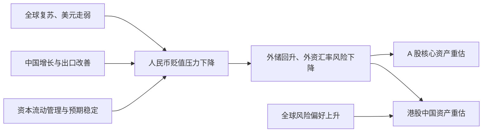
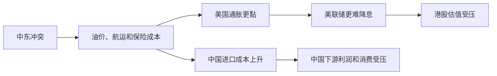

# 用离岸人民币判断 A 股和港股，但别把它当领先指标

先给结论。

离岸人民币与 A 股、港股存在明显的阶段性共振。但人民币不是股票的稳定领先指标。它更像中国外部资金环境、出口结汇和市场信心的温度计。

2017 年和 2020 年下半年，两次人民币升值都与 A/H 股上涨同时发生。两次行情也都在中途背离。2018 年 1 月和 2021 年 2 月之后，人民币仍然偏强，股票已经转弱。

当前确实处于新一轮周期中。但这轮周期从 2025 年 4 月已经启动。现在得到确认的是人民币、国际收支、高端制造和 AI 资本开支周期，不是消费、房地产和企业盈利全面复苏推动的普涨牛市。

{/* truncate */}

> 数据截至北京时间 2026 年 8 月 5 日。📗 表示已由一手来源或公开行情数据核实。📙 表示基于事实的推断。📕 表示尚未得到足够证据支持的叙事。本文统一使用 USD/CNH。数值下降代表离岸人民币升值。

## 先把三段行情放在一起

下表使用月末收盘价。不同交易所有休市差异，因此它适合判断中期方向，不用于比较单日先后。

| 阶段 | USD/CNH | 上证指数 | 沪深 300 | 恒生指数 | 恒生国企指数 |
|---|---:|---:|---:|---:|---:|
| 2017.1—2018.1 | -7.8% | +10.2% | +26.2% | +40.8% | +38.3% |
| 2018.1—2018.4 | +0.3% | -11.5% | -12.1% | -6.3% | -9.1% |
| 2020.6—2021.2 | -8.3% | +17.6% | +28.2% | +18.6% | +15.3% |
| 2021.2—2021.12 | -2.0% | +3.7% | -7.4% | -19.3% | -26.8% |
| 2021.12—2022.3 | 基本持平 | -10.7% | -14.5% | -6.0% | -8.6% |

前半段的共同特征很清楚：人民币升值，股票上涨，港股弹性通常更大。

后半段也很清楚：人民币没有立即转弱，股票却先跌。只看汇率，会错过股票合力已经改变的信号。

## 2017 年是增长、资金和信心一起修复

### 先还原当时的时间线

2016 年末，市场担心人民币继续贬值、资本外流和外汇储备下降。2017 年出现了反转。

- 📗 全球经济同步复苏，美元走弱。
- 📗 中国经济与出口改善，前三季度 GDP 增长保持稳定。
- 📗 2017 年 5 月，人民币中间价机制加入逆周期因子。
- 📗 2017 年 6 月，MSCI 宣布把 A 股纳入新兴市场指数。
- 📗 2017 年 7 月，债券通北向通开通。
- 📗 外汇储备从 2 月到 12 月连续 11 个月增加。

[国家外汇管理局](http://m.safe.gov.cn/safe/2018/0118/8231.html)披露，2017 年银行结售汇逆差同比下降 67%，外汇储备增加 1294 亿美元。市场主体的购汇意愿下降，远期结售汇逆差也明显收窄。

这不是单独一根汇率线发生变化。增长、资本流动、政策预期和资产开放同时改善。

### 多股力量为什么在此时汇合



人民币升值和股票上涨在这里是共同结果。它们都在反映中国尾部风险下降和全球风险偏好改善。

港股涨得更多，因为它同时获得三股力量：

1. 中国企业盈利改善；
2. 美元走弱和全球资金风险偏好上升；
3. 海外资金重新配置中国资产。

A 股内部也不是普涨。沪深 300 明显强于上证指数，说明资金偏向盈利确定、流动性好、能够被外资配置的龙头公司。

### 2018 年 1 月发生了第一次背离

2018 年 1 月之后，A/H 股都开始下跌。人民币到 3 月仍然保持强势。

股票开始交易新的力量：

- 国内金融去杠杆和信用收缩；
- 地方融资受限，基建投资放慢；
- 前期上涨后的高估值和拥挤仓位；
- 中美贸易摩擦逐渐进入定价。

香港金管局的[人民币汇率波动研究](https://www.hkma.gov.hk/media/eng/publication-and-research/research/research-memorandums/2021/RM04-2021.pdf)指出，2018 年 1 月的人民币升值主要由市场情绪和全球冲击驱动，不完全来自国内供需基本面。

这解释了背离。汇率仍在交易美元走弱和稳定预期，股票已经开始交易信用与盈利转弱。

## 2020 年是疫情错位与出口顺差行情

### 中国先恢复生产，海外先释放需求

2020 年上半年，疫情先打断中国生产，再冲击全球需求。到 2020 年下半年，中国制造率先恢复，海外财政和货币刺激又制造了大量商品需求。

[2020 年中国国际收支报告](https://www.safe.gov.cn/safe/file/file/20210326/0ca78a7af7ce4ab98fc477d0ac558279.pdf)显示：

- 📗 货物贸易顺差较 2019 年增长 31%；
- 📗 服务贸易逆差收窄 44%；
- 📗 证券投资保持顺差；
- 📗 二季度以后证券投资重新转为净流入。

人民币升值、沪深 300 核心资产和港股同步上涨，背后仍是同一组合：出口、增长预期、利差、外资流入和风险偏好改善。

### 2021 年 2 月发生了第二次背离

2021 年 2 月之后，人民币继续升值，沪深 300 和港股却转弱。恒生国企指数到年底下跌约 27%。

两类资产开始交易不同的信息。

| 资产 | 当时主要交易什么 |
|---|---|
| 人民币 | 出口顺差、企业结汇、国际收支和中国较高的名义利率 |
| A 股 | 国内信用见顶、核心资产高估值、房地产去杠杆和盈利放缓 |
| 港股 | 中国盈利、平台监管、美债利率和海外风险溢价 |

2021 年下半年又出现房地产紧缩、平台监管、消费恢复不足和反复疫情。到 2022 年 3 月，俄乌战争、中概股退市风险和国内疫情进一步压低股票风险偏好。

人民币依靠贸易顺差暂时保持强势。股票已经提前反映增长和盈利下行。

两次历史分叉都说明一件事：**人民币强而股票弱，可以持续数月。** 经常账户、企业结汇和政策管理能够支撑汇率，但它们不能代替企业盈利。

## 港股为什么对离岸人民币更敏感

港股公司大量收入来自内地，以人民币计价。股票使用港元交易，资金成本却受美元体系约束。

```text
中国盈利与人民币
+ 美元利率和全球流动性
+ 中国风险溢价
= 港股定价
```

人民币升值有两项直接好处。

1. 人民币利润折算成港元或美元后的价值上升。
2. 海外投资者持有中国资产的汇率风险下降。

但只要美债实际利率上升，或者中国盈利预期下调，这两项好处就可能被抵消。

A 股主要由国内资金、政策和信用条件定价。人民币对 A 股更多是间接信号。人民币升值还会压缩部分出口企业以人民币计算的利润，因此不能把“人民币升值”机械写成“所有 A 股利好”。

## 相关性只支持同期共振，不支持稳定领先

使用月末对数收益计算，人民币升值与各指数的同期相关性如下。

| 样本 | 月数 | 上证 | 沪深 300 | 恒指 | 国企指数 |
|---|---:|---:|---:|---:|---:|
| 2017.1—2018.4 | 15 | 0.48 | 0.46 | 0.60 | 0.65 |
| 2020.6—2022.3 | 21 | 0.47 | 0.62 | 0.35 | 0.36 |

这些数字只说明两类资产在特定周期经常同向。样本很小，也没有控制美元、利率、信用和盈利等共同变量。

把人民币收益领先股票一个月后，相关性不稳定，有时还会转为负数。因此不能得出“人民币升值一个月后股票必涨”的结论。

## 当前周期从 2025 年 4 月已经启动

### 先确认价格已经走了多远

2025 年 4 月关税冲击期间，离岸 USD/CNH 一度接近 7.43。到 2026 年 8 月 4 日约为 6.75，人民币从极端位置升值约 9%。

若统一使用 2025 年 4 月末到 2026 年 8 月 5 日的可比口径，市场变化如下。

| 资产 | 涨跌 |
|---|---:|
| USD/CNH | -7.2% |
| 上证指数 | +18.3% |
| 沪深 300 | +23.5% |
| 创业板 | +81.5% |
| 恒生指数 | +17.2% |
| 恒生国企指数 | +6.5% |
| 恒生科技指数 | -3.0% |

这不是一轮刚刚起步的行情。人民币、A 股成长和制造链已经完成明显重估。

恒生科技没有同步上涨，说明它也不是所有中国资产一起上升的传统牛市。

### 当前真实世界时间线

1. **2025 年 4 月：**关税冲击把离岸人民币推到阶段低位，中国资产风险溢价上升。
2. **2025 年二季度以后：**出口韧性、美元阶段走弱、企业结汇和中国科技制造预期推动人民币与 A 股修复。
3. **2026 年上半年：**全球 AI 资本开支继续拉动半导体、电子元件、设备和电力需求。
4. **2026 年 3 月以后：**中东战争打断全球去通胀，油价、航运和保险成本上升。
5. **2026 年 7 月：**人民币在美债利率偏高、能源成本上升的环境下仍接近 6.75，显示出口结汇和跨境资金提供了独立支撑。
6. **2026 年 7 月 29 日：**美联储把利率维持在 3.50%—3.75%，三名委员主张加息。
7. **2026 年 7 月 30 日：**中国政治局会议要求宏观政策发力提效，扩大内需，稳定房地产，提升资本市场信心。

## 当前多空力量没有全面同向

| 力量 | 方向 | 强度 | 时间尺度 | 说明 |
|---|---|---|---|---|
| 出口与货物贸易资金流入 | 支持人民币、制造链 | 强 | 月到季 | 与 AI 外需部分相关 |
| 非银行部门跨境资金净流入 | 支持人民币资产 | 中强 | 月到季 | 与贸易流部分相关 |
| AI 全球资本开支 | 支持高端制造 | 强 | 季到年 | 与出口相关 |
| 国内政策逆周期调节 | 支持 A 股 | 中 | 月到季 | 仍需需求数据验证 |
| 国内消费、房地产和民间投资 | 压制全面盈利修复 | 强 | 季到年 | 当前仍是供强需弱 |
| 美国高利率与实际利率 | 压制港股估值 | 中强 | 月到季 | 与能源通胀相关 |
| 中东能源和航运冲击 | 压制中国下游利润 | 中强 | 周到季 | 同时增加美国通胀 |
| 关税和技术限制 | 压制风险溢价 | 中 | 季到年 | 也会推动国产替代 |
| 前期成长板块涨幅与拥挤 | 压制短期赔率 | 强 | 日到月 | 属于市场内部反馈 |

不能把出口、贸易顺差、结汇和人民币升值算作四份独立证据。它们主要来自同一条因果链。

也不能把 AI 订单、电子出口和成长股上涨机械算作三股力量。它们同样高度相关。

## 当前合力方向

### 离岸人民币中等偏强

📗 [外汇局](https://www.safe.gov.cn/safe/2026/0717/27705.html)披露，2026 年上半年非银行部门跨境资金净流入 2472 亿美元，货物贸易资金净流入增加，外资来华投资总体回升。6 月末外汇储备为 3.4163 万亿美元。

人民币当前不只是被动跟随美元。出口、结汇和跨境资金正在提供支撑。

但人民币更可能进入强势震荡，而不是无限单边升值。油价、中美利差、企业对外投资和出口放缓都构成反向力量。

### A 股结构性向上，指数进入高波动

📗 [海关总署](http://www.customs.gov.cn/customs/2026-07/15/article_2026071510423951069.html)披露，上半年货物贸易进出口增长 16.9%，出口增长 13.4%，进口增长 22.1%。AI 相关电子产品和高技术制造是重要增量。

这支持设备、算力、电力、电子和高端制造。但内需、房地产和民间投资仍弱，不能把出口景气外推到全部 A 股盈利。

创业板累计涨幅已经很高。当前继续上涨需要盈利兑现，不能只靠人民币和叙事扩张估值。

### 港股处于修复候选，不是确定主升

港股比 A 股多一层美元约束，也比人民币多一层企业盈利约束。

[美联储 7 月声明](https://www.federalreserve.gov/newsevents/pressreleases/monetary20260729a.htm)仍称通胀高于目标，三名委员主张加息。[美国 6 月 PCE](https://www.bea.gov/news/2026/personal-income-and-outlays-june-2026)显示核心 PCE 同比增长 3.3%。

这不是港股顺畅扩张估值的外部环境。港股要形成主升，需要中国盈利改善与美国实际利率下降同时发生。

### 综合方向不是普涨牛市

当前已经确认的周期有两条：

1. 中国国际收支和人民币信心修复；
2. AI、高端制造和出口产业周期。

仍未确认的周期也有两条：

1. 国内信用、消费和房地产全面修复；
2. 港股互联网自由现金流和盈利重新加速。

因此，本期合力判断是：**人民币中等偏强，A 股结构性向上，港股处于高波动修复候选。整体不是普涨牛市。**

## 世界局势正在形成两股相反力量

[IMF 2026 年 7 月展望](https://www.imf.org/en/news/articles/2026/07/08/sp070826-weo-update-july-2026-press-conference-opening-remarks)把当前世界概括为能源冲击与技术投资繁荣并存。全球增长仍在继续，但去通胀已经停滞。

### 战争、能源和高利率压制风险资产



这股力量同时压制港股估值和中国下游利润。它也是人民币继续升值的主要外部阻力。

### AI、设备和电力投资支持制造链


这股力量支持人民币和制造链，却不保证高估值成长股继续上涨。资本开支越大，市场越会追问收入和自由现金流何时跟上。

## 估计合力还能持续多久

### 基准路径：未来一到两个季度维持结构行情

人民币在 6.7—7.0 一带双向波动。出口和结汇提供下沿支撑，中美利差与油价限制升值速度。

A 股继续轮动。能够兑现订单与现金流的制造和设备公司强于只靠主题扩张估值的公司。

港股可能反复修复。但在美国实际利率明显下降前，持续主升的条件不足。

### 提前结束条件

- 出口订单和高技术产品出口连续走弱；
- 结售汇与跨境资金重新出现持续净流出；
- 油价再度大涨，人民币和中国制造利润同时承压；
- 美联储加息或美债实际利率持续上升；
- 国内信用、消费和地产继续恶化；
- 人民币保持强势，但沪深 300、恒生科技和盈利预期同时下行。

最后一种情况尤其重要。它可能重演 2018 年和 2021 年的背离。

### 延长和升级条件

- 中国消费、房地产销售、民间投资和企业盈利同步改善；
- 政策从表态进入财政支出与信用数据；
- 美国通胀下降，实际利率和美元同步回落；
- 人民币升值同时伴随股票盈利上修，而不只是估值上涨；
- 恒生科技由落后转为领涨，外资和南向资金同时增加。

这些条件若同时出现，当前结构周期才会升级为人民币、A 股和港股的全面共振。

## 当前最优载体不能只靠汇率选

本期研究能够把市场分层，但不足以直接选出一家公司。

| 层级 | 当前判断 |
|---|---|
| 市场 | A 股的外部约束少于港股，当前确定性更高 |
| 板块 | 高端制造、设备、电力、算力和能兑现订单的出口链优先 |
| 公司 | 必须检查汇率敏感度、海外收入、订单、现金流和估值 |
| 股票 | 本期没有完成公司级比较，因此不凑一只股票 |

人民币升值会降低进口设备和原材料成本，却会减少美元收入折算成的人民币利润。出口占比高不等于一定受益。

后续选股必须区分：

- 依赖低价竞争、利润率薄的出口企业；
- 拥有技术、品牌、设备或供应链壁垒，能够转嫁汇率变化的企业；
- 收入来自国内需求，但成本受益于人民币升值的企业。

第二类更接近 Tide 所说的能力租金。第一类可能只有出口身位红利。

## 当前只能给观察区，不能伪造买点

这次研究完成了汇率与指数的历史分段，但没有完成当前候选股票的同类回调回测。

缺少以下输入：

- 具体股票在人民币升值周期中的历史样本；
- 当前估值分位与盈利修正；
- 回调幅度、持续时间和失败样本；
- A 股交易成本、T+1 与做 T 底仓安排；
- 港股点差、汇率和流动性成本。

因此，本期不给精确价格买点，只给三层触发条件。

### 背景

人民币强势没有被破坏，出口与跨境资金仍为净流入，国内政策开始转化为需求数据。

### 位置

候选指数或股票从高位回调后，估值和价格回到同类上涨周期的中位区间。当前还没有完成这一步的统计。

### 触发

价格不再因利空创新低，成交卖压下降，盈利预期停止下修。人民币、股票和盈利至少两项重新同向。

### 失效

人民币走强但盈利继续下修，或人民币转弱同时股票跌破前低。前者对应历史背离，后者代表外部和内部力量同时转坏。

## 接下来只盯十二个信号

1. USD/CNH 是否能在 6.75 附近保持强势，而不是快速回到 7.0 上方；
2. CFETS 人民币指数是否同步走强，排除只有美元走弱的影响；
3. 银行结售汇和企业结汇率；
4. 外汇储备与跨境证券投资流；
5. 中国出口订单、高技术产品出口和贸易顺差；
6. 社会融资、企业中长期贷款和信用脉冲；
7. 社零、房地产销售和民间投资；
8. 沪深 300 盈利预期是否上修；
9. 恒生科技能否结束对人民币和恒指的长期落后；
10. 美国核心 PCE、10 年期实际利率和美元指数；
11. 霍尔木兹通航、Brent 油价和油轮保险费；
12. AI 云厂商资本开支、自由现金流和亚洲供应链订单。

## 复盘上一期世界局势判断

[上一期世界资产地图](/blog/2026/07/29/world-roles-and-assets-map)判断，中国是“生产和出口强，内需和投资弱”，港股同时受中国盈利与美元流动性约束。

这次汇率回溯支持了前半句。人民币在高美债利率和中东能源冲击下仍然偏强，出口、结汇和跨境资金确实提供了支撑。

它也加强了后半句。恒生科技没有跟随本轮人民币和 A 股成长行情，说明港股不能只用中国出口或人民币解释。美国实际利率、平台盈利和风险溢价仍在压制它。

上一期没有把 2018 年和 2021 年的背离放进框架。本期补上这一点：人民币能够确认外部资金环境，却不能确认股票盈利周期。

## 数据口径与来源

- 📗 离岸人民币日线：[新浪财经 USD/CNH 历史行情](https://vip.stock.finance.sina.com.cn/forex/api/jsonp.php/var%20_DATA=/NewForexService.getDayKLine?symbol=fx_susdcnh)；
- 📗 指数月线：腾讯证券公开行情接口，覆盖上证、沪深 300、创业板、恒指、恒生国企和恒生科技；
- 📗 2017 年跨境资金：[国家外汇管理局 2017 年外汇收支发布会](http://m.safe.gov.cn/safe/2018/0118/8231.html)；
- 📗 2020 年国际收支：[国家外汇管理局 2020 年中国国际收支报告](https://www.safe.gov.cn/safe/file/file/20210326/0ca78a7af7ce4ab98fc477d0ac558279.pdf)；
- 📗 人民币历史驱动：[香港金管局人民币汇率波动研究](https://www.hkma.gov.hk/media/eng/publication-and-research/research/research-memorandums/2021/RM04-2021.pdf)；
- 📗 2026 年外汇收支：[国家外汇管理局上半年发布会](https://www.safe.gov.cn/safe/2026/0717/27705.html)；
- 📗 2026 年外贸：[海关总署上半年数据](http://www.customs.gov.cn/customs/2026-07/15/article_2026071510423951069.html)；
- 📗 中国政策：[7 月 30 日中央政治局会议](https://www.gov.cn/yaowen/liebiao/202607/content_7077056.htm)；
- 📗 美国政策：[美联储 2026 年 7 月 FOMC 声明](https://www.federalreserve.gov/newsevents/pressreleases/monetary20260729a.htm)；
- 📗 美国通胀：[BEA 2026 年 6 月个人收入与支出](https://www.bea.gov/news/2026/personal-income-and-outlays-june-2026)；
- 📗 世界经济：[IMF 2026 年 7 月世界经济展望更新](https://www.imf.org/en/news/articles/2026/07/08/sp070826-weo-update-july-2026-press-conference-opening-remarks)。

## 结论

离岸人民币最有价值的用法，不是猜第二天股票涨跌。它适合回答两个问题：外部资金环境有没有改善，中国资产的汇率风险有没有下降。

它不能回答企业盈利是否见底，也不能回答当前估值是否便宜。

本轮新周期已经成立，但只在国际收支、高端制造和 AI 产业链上得到确认。要升级为全面行情，还需要国内信用与盈利接棒，也需要美国实际利率和中东能源压力下降。

在这些条件出现前，人民币强只能提高中国资产的候选等级，不能替代买点。
